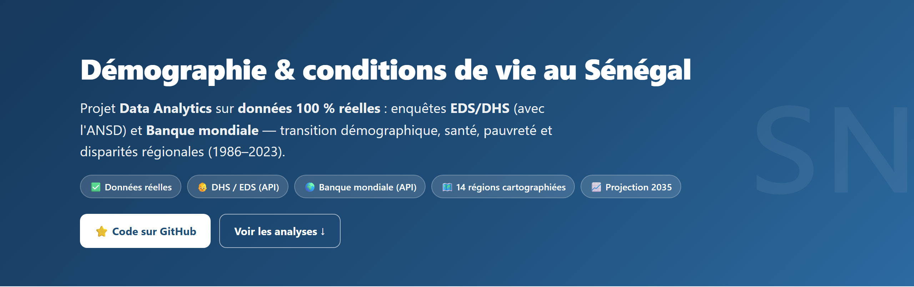
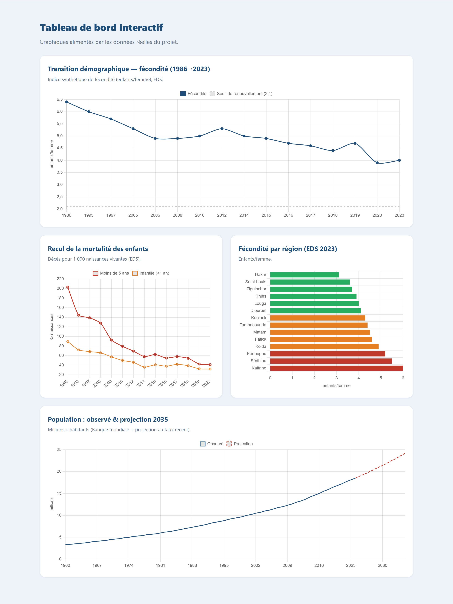
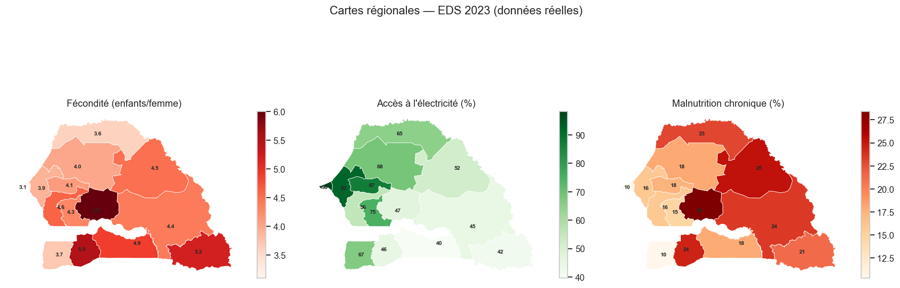

# 🇸🇳 Démographie, santé & conditions de vie au Sénégal (1986–2023)

> Projet **Data Analytics** sur **données 100 % réelles et officielles** :
> enquêtes **EDS/DHS** (menées avec l'ANSD) et indicateurs de la **Banque
> mondiale**, exposés via leurs **APIs publiques**. De l'acquisition automatisée
> à la projection, avec analyse régionale cartographiée.


### 🌍 [**Voir le site web du projet (démo en ligne)**](https://kheuch1492.github.io/senegal-demographie/)

[](https://kheuch1492.github.io/senegal-demographie/)

> *Tableau de bord interactif (graphiques alimentés par les données réelles) :*



---

## 🎯 Objectif

Analyser la **transition démographique** et les **conditions de vie** au Sénégal :

- suivre l'évolution de la **fécondité**, de la **mortalité des enfants** et de la
  **pauvreté** sur près de 40 ans ;
- comparer les **14 régions** (fécondité, électricité, éducation, malnutrition) ;
- relier **éducation des femmes** et **fécondité** ;
- **projeter** fécondité et population à l'horizon 2035.

---

## 📊 Résultats clés (données réelles)

| Indicateur | Résultat |
|---|---|
| Fécondité | **6,4 (1986) → 4,0 (2023)** enfants/femme |
| Mortalité des moins de 5 ans | **203 ‰ → 41 ‰** (recul spectaculaire) |
| Pauvreté nationale | **≈ 37,5 %** (2021) |
| Population jeune (< 15 ans) | **≈ 38 %** |
| Écart régional de fécondité (2023) | **Dakar 3,1** ↔ **Kaffrine 6,0** |
| Corrélation éducation des femmes ↔ fécondité | **−0,64** |
| Population projetée 2035 | **≈ 24 M** (vs 18,5 M aujourd'hui) |



---

## ⚠️ Sources & transparence

- **DHS / EDS** (`api.dhsprogram.com`) : enquêtes démographiques et de santé
  réalisées avec l'**ANSD** — séries nationales **1986→2023** + détail **régional**
  (EDS 2023).
- **Banque mondiale** (API v2) : pauvreté, Gini, population, structure par âge,
  urbanisation, espérance de vie.
- **geoBoundaries** : contours des 14 régions.

> Les **microdonnées EHCVM/RGPH** nécessitent une inscription (ANADS / World Bank
> Microdata) et ne sont pas téléchargeables par script. Ce projet exploite les
> **indicateurs officiels** issus de ces enquêtes, accessibles via les APIs
> ci-dessus. Tout est téléchargé par
> [`scripts/download_data.py`](scripts/download_data.py).

---

## 🗂️ Structure

```
senegal-demographie/
├── data/{raw,processed,geo}/       # CSV API (DHS, Banque mondiale) + GeoJSON
├── notebooks/
│   ├── 01_acquisition_preparation.ipynb   # nettoyage (régions) + tables
│   ├── 02_analyse_exploratoire.ipynb      # EDA + 3 cartes choroplèthes
│   └── 03_tendances_projection.ipynb      # projection fécondité & population
├── sql/                            # schéma + 10 requêtes analytiques
├── powerbi/                        # tables prêtes + mesures DAX + guide de dashboard
├── scripts/                        # download_data · _build_notebooks · build_site · build_powerbi · run_all
├── reports/figures/                # 9 graphiques (dont cartes)
├── docs/                           # site web (GitHub Pages)
└── README.md
```

---

## 🚀 Reproduire

```bash
python -m venv .venv && .venv\Scripts\activate
pip install -r requirements.txt
python scripts/run_all.py     # télécharge les données réelles -> notebooks -> figures -> site
```

---

## 🎓 Compétences démontrées

Acquisition via **APIs** (DHS, Banque mondiale) · nettoyage de données
hiérarchiques (régions) · indicateurs démographiques & de santé · **analyse
géospatiale** (cartes choroplèthes) · analyse de corrélation · projection de
tendances · **SQL** analytique · **Power BI** (modèle en étoile + DAX) ·
data storytelling · pipeline reproductible.

## 📊 Dashboard Power BI

Tables prêtes à l'emploi, mesures DAX et guide de construction pas-à-pas dans
[`powerbi/`](powerbi/README_powerbi.md) — modèle en étoile (`faits_national`,
`faits_regional`, `dim_indicateur`, `dim_region` avec centroïdes, `dim_annee`),
KPI, cartes choroplèthes régionales et segments interactifs.

---

*Projet portfolio Data Analyst / BI. Données réelles DHS/EDS & Banque mondiale.*
