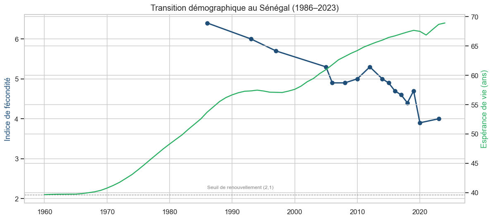

# Rapport analytique — Démographie, santé & conditions de vie au Sénégal

*Données réelles : EDS/DHS (1986–2023) & Banque mondiale.*

## 1. Données & méthode
- **EDS/DHS** via API : 10 indicateurs (fécondité, mortalité infantile/néonatale,
  contraception, accouchements assistés, malnutrition, alphabétisation, eau,
  électricité), en **séries nationales** (16 enquêtes depuis 1986) et en **détail
  régional** (EDS 2023, 14 régions).
- **Banque mondiale** : pauvreté, Gini, population, structure par âge, urbanisation,
  espérance de vie.
- Nettoyage notable : les libellés régionaux DHS sont hiérarchiques (zones-agrégats,
  anciennes limites `(2005)`) → isolement des **14 régions administratives actuelles**.

## 2. Principaux résultats
- **Transition démographique** nette mais inachevée : fécondité **6,4 → 4,0**
  enfants/femme ; espérance de vie en forte hausse ; population toujours très
  **jeune** (~38 % de moins de 15 ans).
- **Succès de santé publique** : mortalité des moins de 5 ans divisée par ~5
  (**203 ‰ → 41 ‰**).
- **Pauvreté** en lent recul (~37,5 % en 2021), inégalités modérées (Gini ~36).
- **Fortes disparités régionales** : Dakar (fécondité 3,1 ; électricité 98 %)
  contraste avec Kaffrine/Kolda/Sédhiou (fécondité 5,5–6,0 ; électricité < 50 %).
- L'**éducation des femmes** est corrélée négativement à la fécondité (**−0,64**).

## 3. Projection (illustrative)
La tendance linéaire récente prolonge la baisse de la fécondité (≈ 3,5 en 2035)
sans atteindre le seuil de renouvellement (2,1) avant ~2058. La population
continuerait de croître (**~24 M en 2035**), ouvrant une fenêtre de **dividende
démographique** conditionnée aux investissements en éducation et santé.

## 4. Recommandations
- **Cibler les régions du centre/sud/est** (forte fécondité, faible accès aux
  services) pour l'électrification, l'eau et l'éducation des filles.
- Renforcer la **planification familiale** (contraception moderne encore à ~26 %).
- Capitaliser sur la baisse de la mortalité infantile et la jeunesse de la
  population (formation, emploi).
